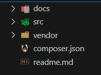

#### Configuração do Projeto


<p>Você pode tecnicamente executar o Composer em qualquer lugar, mas se você quiser publicar um pacote no Packagist.org, ele precisará encontrar o arquivo no topo do seu repositório VCS.</p>

#### Inicializando um projeto com composer
```shell
composer init
```

#### Configurando vendor Github e name

Package name (<vendor>/<name>) [xxxx/php_pdo_data_base]: meuusuario/meuprojeto

#### Descrição 

Descrição: Forneça uma breve descrição do projeto.

#### Author: Insira o nome do autor no formato Nome <email>.
```shell
Author [Seu Nome <email@example.com>, n para nenhum]: Seu Nome <seuemail@example.com>

```
#### Tipo de projeto: Geralmente você pode deixar em branco para o tipo padrão library.
Minimum Stability []: 

License []: MIT

#### Dependências: O Composer perguntará se você quer definir dependências agora. Você pode definir as dependências necessárias ou pular para definir mais tarde. (clique enter para pular)

#### Exemplo Projeto composer Inicializado 

#### A chave require

A primeira coisa que você especifica no composer.json é a chave require. Você está dizendo ao Composer quais pacotes o seu projeto depende.

### composer.json

```json
{
    "require": {
        "monolog/monolog": "2.0.*"
    }
}
```

Como você pode ver, require aceita um objeto que mapeia os nomes dos pacotes (por exemplo, monolog/monolog) para restrições de versão (por exemplo, 2.0.*).

#### Instalando Dependências
```shell
php composer.phar update
```


#### 
```shell
composer dump-autoload
```