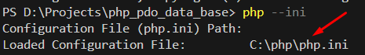
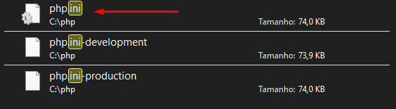
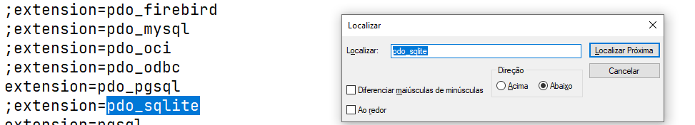
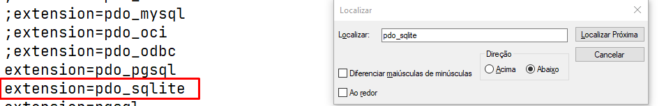

#### Encontrar o caminho do arquivo php ini

```bash
php --ini

```

#### Exemplo 




- Abra o arquivo php.ini
- Aperte a tecla ctrl+F
- Digite pdo_sqlite
<br><br>



- Remova o ;  e salve o arquivo
