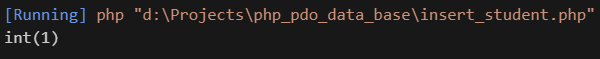

 O método exec retorna um inteiro contendo o número de registros afetados. Se você insere um registro, o número 1 é retornado. Se insere cinco registros, o número 5 é retornado. Se busca dados com SELECT, o número 0 é devolvido, já que nenhum registro foi afetado.

 ```php
 var_dump($pdo ->exec($sqlInsert)); //exec -> Executar sql
 ```
 